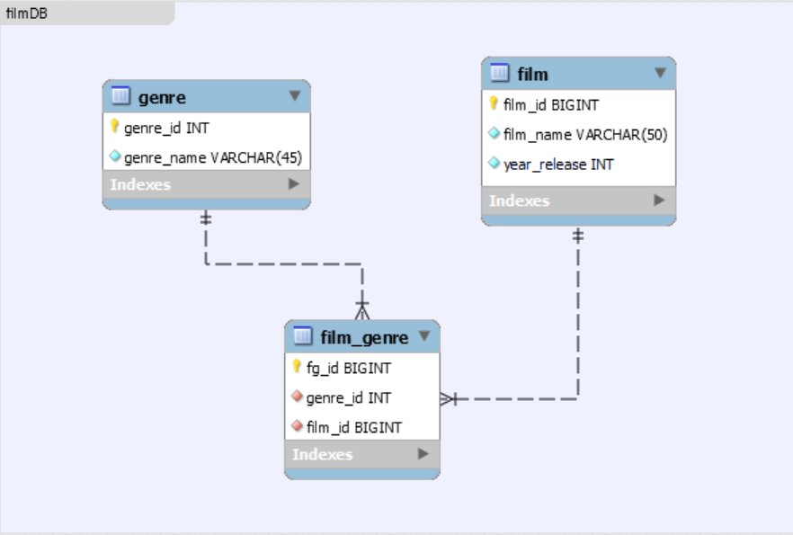

# Node.JS_server
NodeJS server for CRUD interaction with filmDB (PostgreSQL). Step 2, Task 2.

### task_2
Написать маленький сервер на nodeJS, который работает с упрощенной базой данных фильмов
- таблица жанров
   - pk
   - название жанра
- таблица фильмов
  - pk
  - название
  - год выпуска 
У каждого фильма может быть несколько жанров.
Реализовать на nodeJS CRUD опреации для взаимодействия с жанрами с CRUD операции для взаимодействия с фильмами.
Тестировать свою работу можно через postman. В качестве результатов сервер просто возвращает данные в JSON формате.

#### EER diagram предполагаемой БД. 

#### Запуск сервера.
1. npm i
2. Создание базы данных ('CREATE DATABASE filmdb), создание таблиц (файл db.sql).
3. Создать файл .env
   - PORT= "порт"
   - PASSWORD_PG= "ваш пароль в postgres'
4. npm run dev
5. Проверка работы через Postman. Файл filmDB.postman_collection.json. (Порт 8080)

P.S. Добавлена возможность CRUD-взаимодействия с таблицей film_genre.
